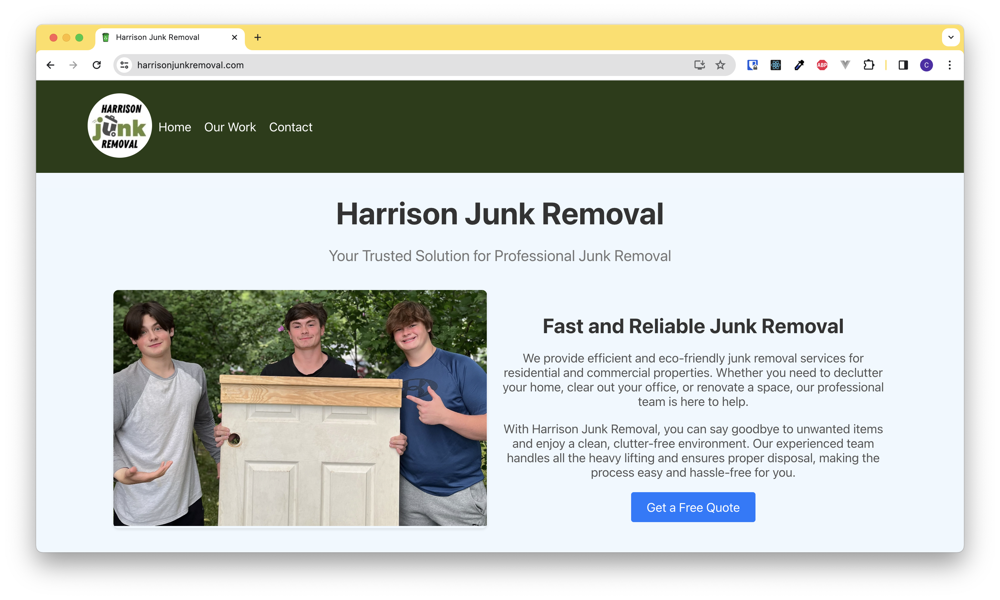
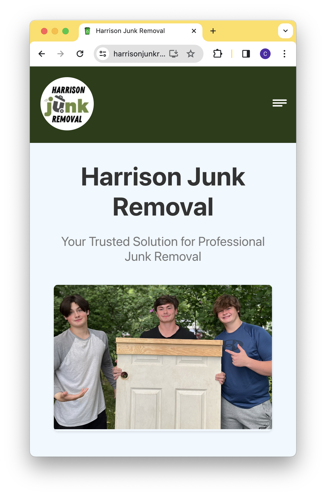
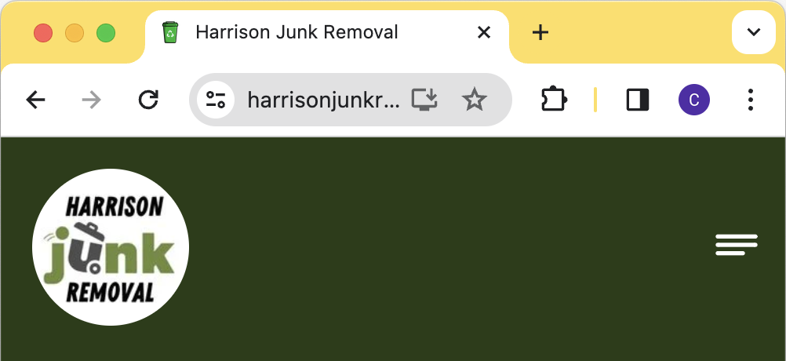
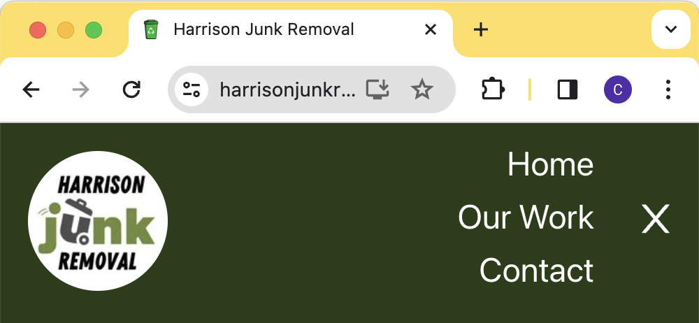
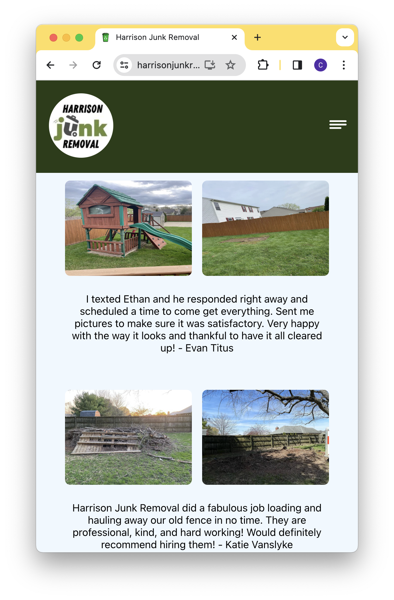
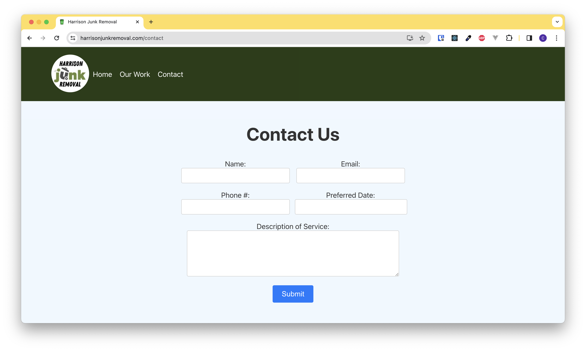
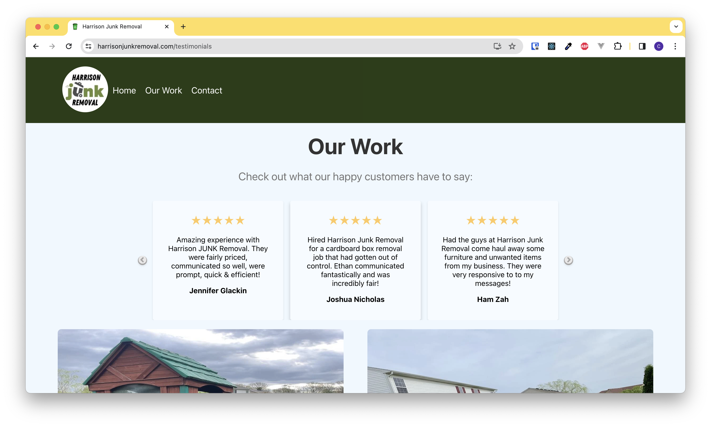
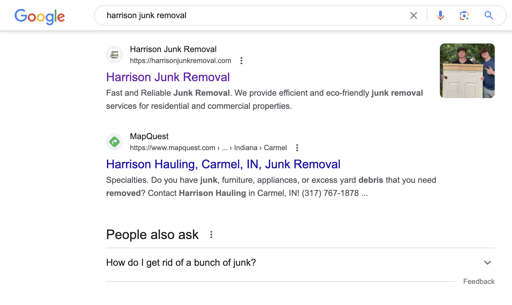

# Designing and Developing the Harrison Junk Removal Website

## Introduction

Creating the website for Harrison Junk Removal was an exciting journey that involved overcoming various design challenges and tackling intricate software development tasks. This blog post delves into the interesting design choices and development challenges we encountered during the process.

## Design Choices

### 1. Modern Aesthetics

One of the primary goals was to give the website a modern, sleek, and visually appealing design. This was achieved through a combination of vibrant colors, clean layouts, and carefully chosen fonts. The aim was to make the website not only informative but also engaging and aesthetically pleasing.

### 2. Responsive Design

To ensure a seamless user experience across devices, we knew a responsive design was a must. The website adjusts gracefully to different screen sizes, maintaining functionality and aesthetic appeal on both desktop and mobile devices.

### 3. Branding Elements

Incorporating branding elements was crucial for creating a strong identity for Harrison Junk Removal. The logo, color scheme, and typography were carefully selected to represent the professionalism and reliability of the business.

### 4. User-Friendly Navigation

Intuitive navigation was a priority. The header design, featuring a clean menu and a prominent logo, allows users to easily explore different sections of the website. For mobile users, we implemented a user-friendly hamburger menu.

Menu Closed:

Menu Open:

## Development Challenges

### 1. Styling the Testimonials Page

The testimonials page presented a unique challenge — how to elegantly showcase customer testimonials? The solution involved dynamically loading before-and-after images for each testimonial. This was particularly tricky, especially when considering the need for responsive design on multiple platforms. Using Media Queries, we eventually landed on a before-and-after UI design that looks great on any device. 

### 2. Contact Form Functionality

Implementing a functional contact form was a critical item. Every small business needs an online presence &mdash; but what good is it if new leads can't be generated? We used React to manage form state and integrated the EmailJS service for email submissions. The challenge here was to ensure that the form worked seamlessly, providing feedback to users on successful submissions or errors.

### 3. Slider Implementation

Creating a visually appealing and responsive slider for the testimonials page required careful consideration. We chose the slick-carousel library and configured it to display multiple testimonials at once, enhancing user engagement and maintaining a modern design. Once interacted with, the carousel will rotate revealing an array of several happy customers. This is an important feature, particularly on mobile, where only one card is shown at a time due to space constraints.

### 4. SEO in React

What good is an app that can't be found from the most popular search engines? This React app was built with SEO in mind, as evidenced by a quick google search:

## Conclusion

The journey of designing and developing the Harrison Junk Removal website was filled with exciting challenges that pushed the boundaries of creativity and technical expertise. Through careful design choices and innovative solutions to development challenges, we were able to create a website that not only represents the brand effectively but also provides users with an engaging and user-friendly experience. The project showcases the synergy between design and development, resulting in a successful online presence for Harrison Junk Removal.

P.S. 

if you're in the Indianapolis area and need some junk hauled, you should [check these guys out!](https://harrisonjunkremoval.com)