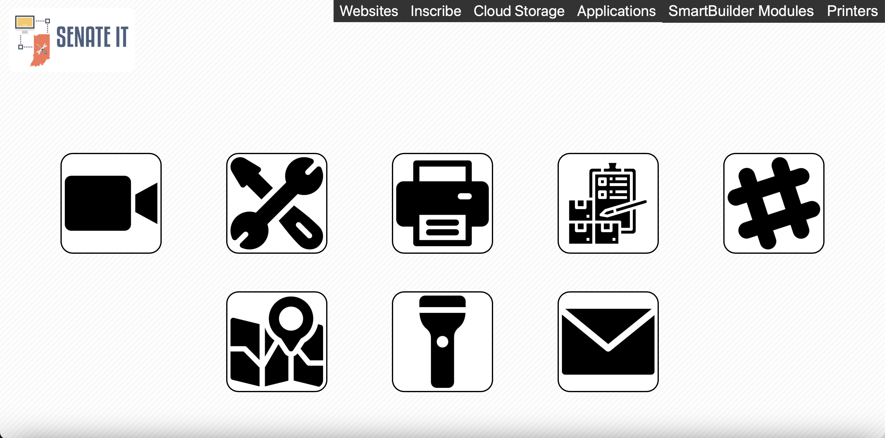
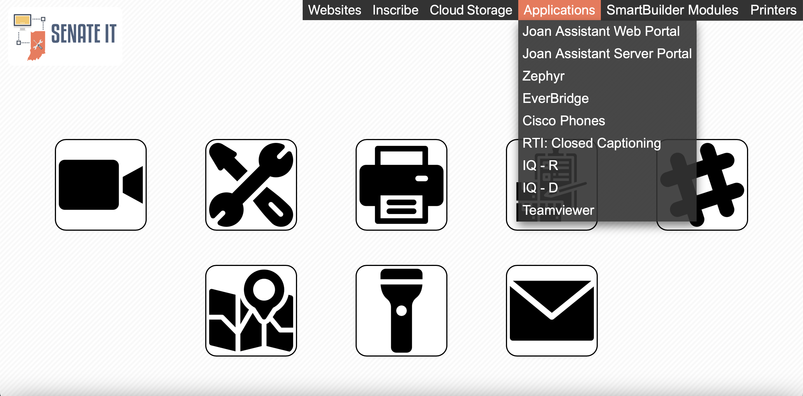
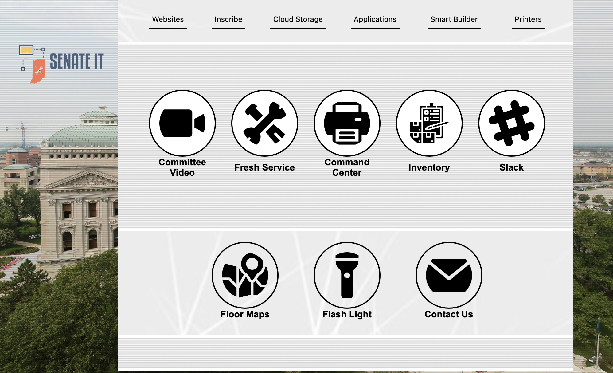
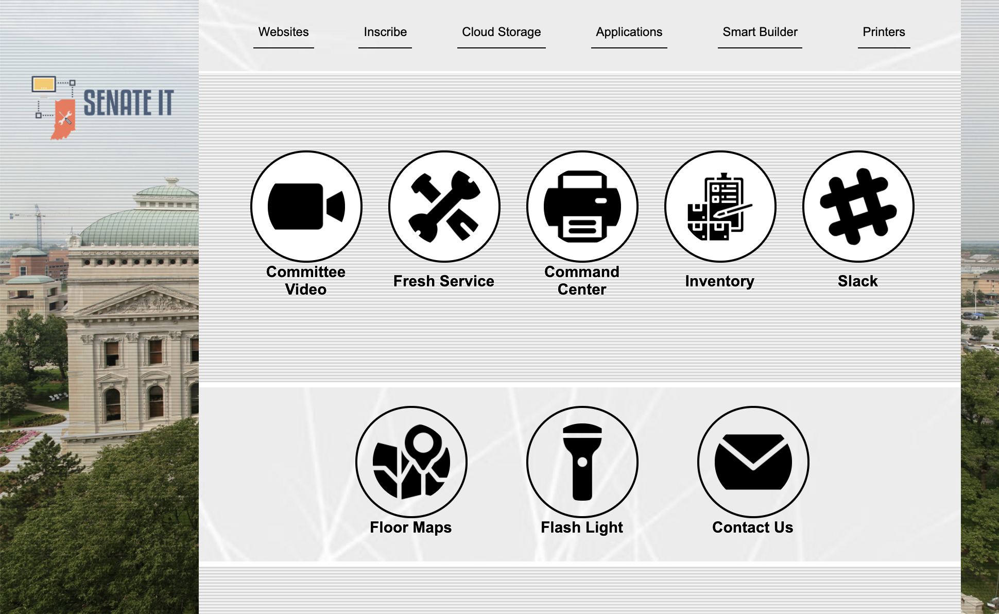
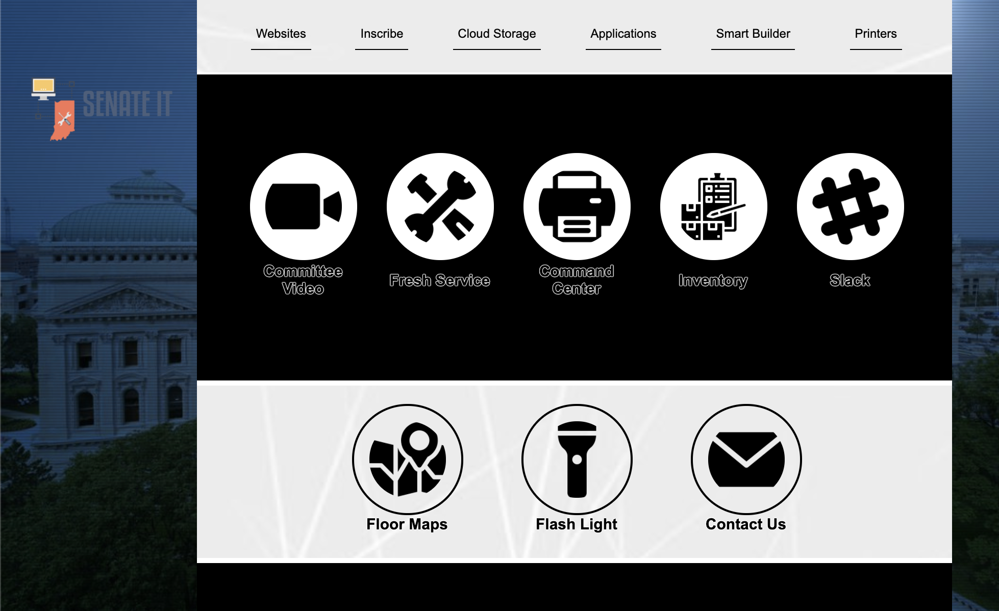
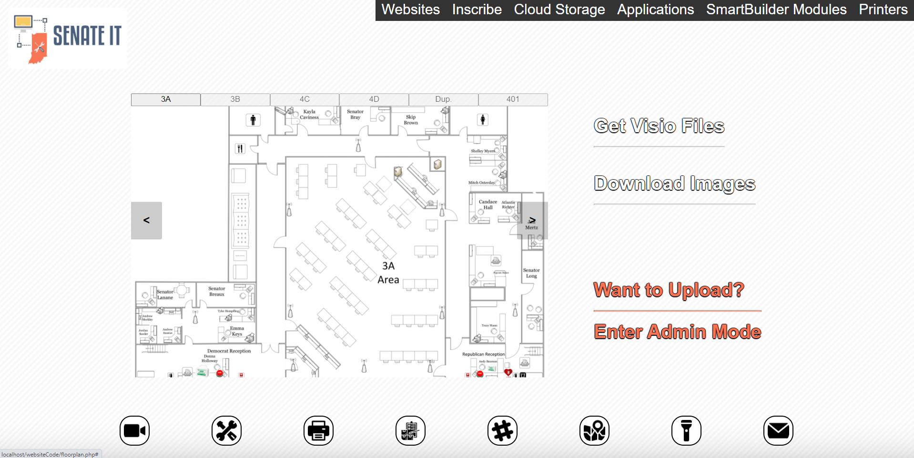
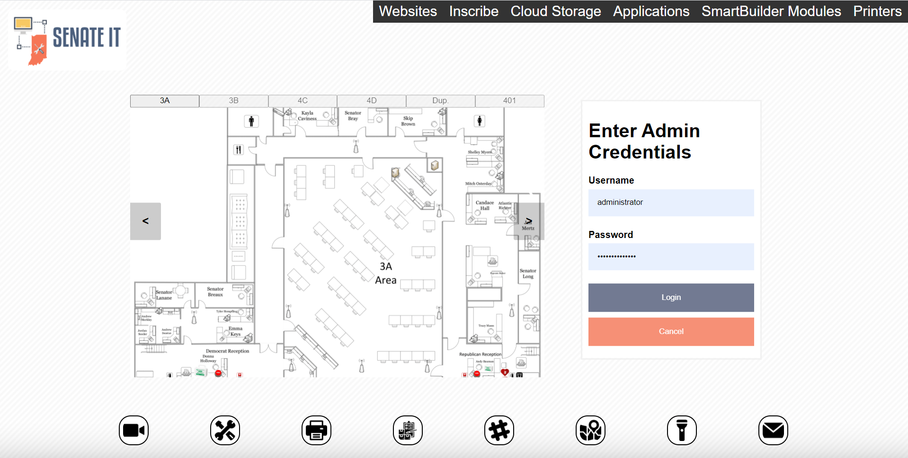
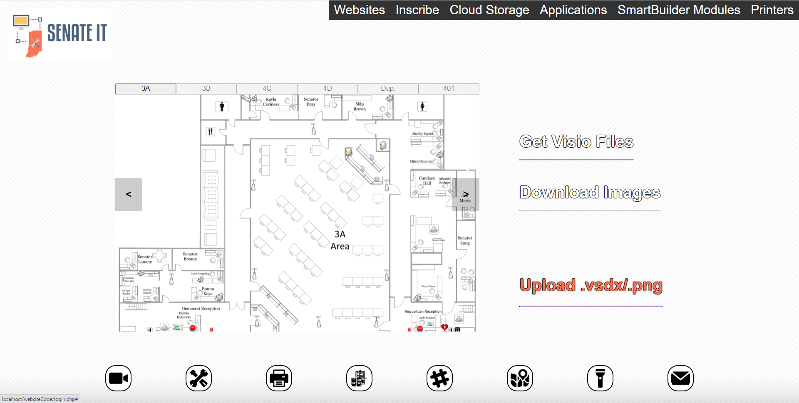
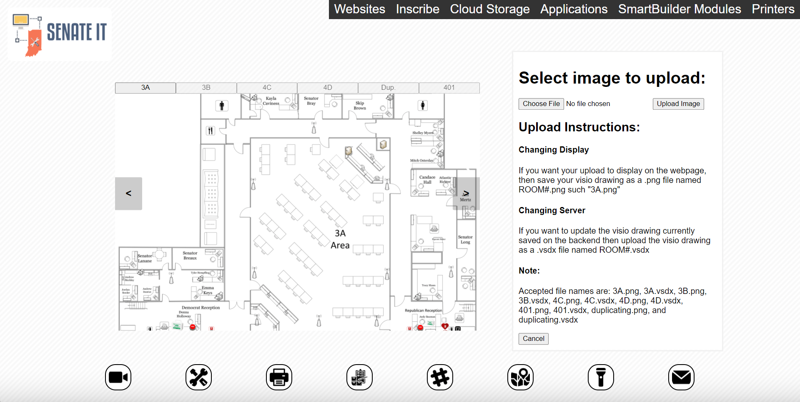
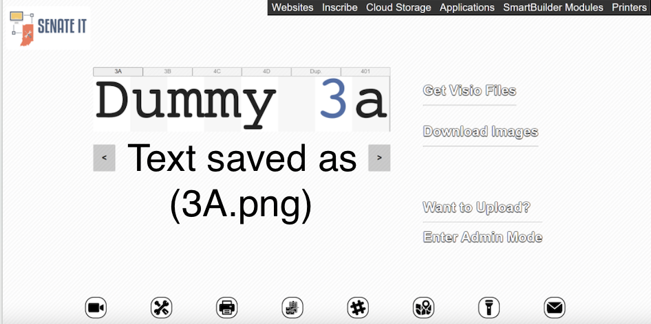

 **Research in Internet Programming: Developing a Website for the
 Indiana Senate Information Technology Department**

 ## Introduction
 The Indiana State Senate Information Technology Department employs
 many useful\
 technologies in its service of the Indiana Senate. Throughout the
 development of this department, the need has arisen to design and
 implement several new technologies. The project that this report
 documents is the design of a website of client-specified complexity
 and functionality to be stored on a server hosted by the Senate IT
 Department. Outlined below are the specific issues that exhibited the
 need for this project, the novel solutions that describe the steps
 that were necessary to complete the project, and a discussion and
 reflection on the research and discoveries made in the field of
 internet programming during the implementation of the project.

### Chapter 1: Introduction

 The Indiana State Senate is the upper member of the two-house
 legislature that is responsible for drafting, amending, and
 potentially passing all of the bills that can possibly be signed into
 state law by the current Governor of Indiana. Throughout this
 aforementioned process, commonly abbreviated as the "legislative
 process," there are many meetings, video streams, and IOT devices
 (such as Bluetooth microphones and sound systems) that require the use
 of the internet to function in service of Senators and legislative
 staff. The magnitude and subsequent senatorial reliance on these
 technologies caused the state to commission a Senate Information
 Technology Department to oversee and aid in the use and implementation
 of all technology for the Senate. In their service to the Senate, the
 Senate IT Department has deemed it necessary to create a website, only
 available to Senators and legislative staff, that should contain
 several features and applications that would be made available for the
 benefit of the Senate.

### Chapter 2: Issues that Demonstrate User Needs

 Several factors lead the Senate IT Department to the conclusion that
 there is a need for a new technological solution. The aforementioned
 solution, designing, developing, and hosting a website accessible to
 all senate employees, purports to fix the issues outlined below. The
 first issue is that many members of the Senate staff recruit the help
 of various different external webpages in the performance of their
 jobs. Throughout the development and addition of new technology into
 the workplace, the list of these websites that users might be required
 to visit has grown substantially large. There exists a need to
 centralize links to these websites on one webpage, so that each
 employee does not have to remember them individually.

 Another issue that can be addressed is an issue that the website
 itself presents. Namely that, according to at least one study cited in
 the references section of this document, staring at a bright webpage
 for long periods of time can increase the likelihood of developing an
 ocular disease.1 In light of the danger that a bright webpage can
 potentially cause to aging employees, the website design can
 incorporate a toggleable dark-theme mode. Since the website is hosted
 by the IT department, it would also make sense to add a contact button
 for any employee who needs to address the IT department.

 A final issue that the website design can address, is the issue that
 all new employees face in trying to navigate the building. The
 complete group of Senatorial staff inhabits a massive amount of
 property that encompasses 4 floors each with a multitude of different
 rooms in the Statehouse. The training process for new legislative
 assistants and interns that takes place every year involves constantly
 informing each employee of basic, navigational directions so that they
 may complete the functions required by their jobs. By hosting an
 admin-editable floor plan on the proposed website, the employees can have access to a directory that is easily updatable as employees come and go.

 The issues that exhibit the need for the creation of such a website
 are manifold. However, various as they may be, each issue, in hopes of
 deriving a solution, can be placed into two main categories. The first
 category, that is responsible for fulfilling most of the client-side
 needs of the website, is the need for a robust front-end development,
 powered by the interaction of JavaScript and HTML / CSS, to allow
 users to make requests for various documents and downloads helpful in
 the execution of their daily activities. The second category, made
 possible by the interaction between the languages mentioned above and
 PHP, is the need for responsive server-side scripting to handle and
 accommodate the requests made by users.

### Chapter 3: Preliminary Solutions

 **Designing a Homepage**

 The internet began with html pages that linked to other webpages
 through hypertext.2 This basic functionality, along with some stock
 images and basic styling, would seem to be all that is still needed to
 design a modern homepage. The only issue with this notion, however, is
 that the Senate IT Department's homepage should link to dozens of
 distinct webpages.

 In order to present an uncluttered and easily navigable menu, a
 dropdown list must be created through manipulating the CSS style
 property "display." Each category of links can be fixed to the top
 right of the page, and then displayed as shown in Figure 1. (Note: the
 images are simply links to external webpages as well).

Figure 1: Homepage with Navigation Menu

 The catch with this image, is that each list of links belonging to the
 subcategories of "Websites, Inscribe, etc." has their display property
 set to "none," by writing "display: none;" in the CSS container for
 the drop-down content.3 The trick to displaying the drop-down menu is
 setting the display property to "block" when the appropriate drop-down
 button is hovered over

 by a cursor. For instance, mousing over "Applications" will produce
 the results shown in Figure 2.

Figure 2: Drop-down Content

### Chapter 4: Presentation of Final Solutions

 **Reconfiguring Design and Adding Buttons for New Applications**

 The minimalist and nondescriptive design of the homepage in Figures 1
 and 2 can easily become confusing for a new user. In order to
 eliminate potential confusion, the next phase of design involved
 adding a more descriptive interface between the user and their needed\
 functionality. This included slightly modifying the style of the
 webpage along with adding three new buttons that offer distinct
 privileges to the user (shown in Figure 3).

Figure 3: Revised Homepage with Three New Buttons

 Each new button, entitled "Floor Maps", "Flash Light", and "Contact
 Us" respectively, offers new functionality. The Floor Maps button
 links to a page, "floorplan.php" that is further

 outlined in the "Creating an Admin-Editable Floor Map" section below.
 The Flash Light button, has an onclick attribute that calls a
 JavaScript function, "toggleLightDark()," that is further explained in
 its corresponding section below. The Contact Us button, by way of a\
 "[mailto:senateit@iga.in.gov]{.underline}" reference, opens the users
 default mail application with a draft destination set to the Senate IT
 Department's helpdesk email.

 **Adding a Toggleable Dark-theme**

 Several potential solutions were ideated during this phase of the
 design. It is possible to create a completely new webpage, perhaps
 titled something like "homepage-dark.html" with different, darker CSS
 styling, and to link this webpage to the flashlight button on the
 light homepage and vice versa. However, while this is possible, it has
 no mechanism to remember the user's preference of theme. This is a
 significant drawback, because it is hard to imagine that any user
 would be willing to use a different theme if they had to select that
 theme every time they used the page. Furthermore, the theme would need
 to persist across multiple different webpages, which would be
 impossible by simply using a different file. This problem, the problem
 of needing to remember the user's preference of theme, resulted in
 long periods of study that eventually lead to the consideration of
 JavaScript Cookies.

 JavaScript Cookies exist to allow the storage of user-specific data in
 small text files on the client-side user's computer. Furthermore, the
 data is stored in name-value pairs, such as "theme=light" or
 "theme=dark" in this case. Cookies solved the problem of remembering
 the state of a user's theme preference, however, the problem of
 actually updating the style of the website without reloading the page
 still remained.

 After adding a simple alternative color scheme such as
 "background-color: #000;" in the style of a copy of the body tag
 titled "dark-theme", it then became necessary to add a toggle switch
 between each theme. Therefore, each time the Flash Light button is
 pressed, a series of JavaScript functions are called that do two
 different, but necessary, things. First, the style currently being
 rendered on the DOM is switched to the alternative style. Second, a
 cookie is set with the user's preference, whether that preference be
 "theme=light", or "theme=dark."

 Finally, once the problem of setting the theme was solved, there
 emerged another need in the design of the theme switcher. The problem
 was that the webpage was not checking for which theme to display on
 startup. This problem was easily solved by adding a call to another\
 JavaScript function enclosed in a script tag placed at the end of the
 body tag of the document.4 The function call,
 "readCookieAndSetTheme()", simply checks the cookies to see what theme
 the user prefers and then displays that theme's corresponding style.
 Figure 4 illustrates the final result on the homepage (Note: see the
 light-dark mode difference between other pages in the appendix).

Figure 4: Light-mode Figure 5: Dark-mode

 **Creating an Admin-Editable Floor Map**

 Due to the size of the Statehouse, all new senate employees, unless
 otherwise familiar with the building, are required to undergo a
 lengthy process in order to learn how to navigate the building they
 work in. Due to the significant turnover of Senate interns and
 employees, this process is repeated many times throughout each annual
 legislative session. Designing a floor plan, that is editable by the
 Senate IT Department staff, would greatly reduce the time cost

 required to train new employees, thereby increasing the efficiency in
 which new employees can be trained.5\
 The Senate has, prior to the development of this website, created
 floor plans using the Microsoft Office 365 software Visio. Visio
 drawings are saved with the specific file extension ".vsdx" (for
 example, a file named "drawing" would have the file name
 "drawing.vsdx").6 These drawings contain the data that needs to be
 displayed on the website. Unfortunately, the Visio file type does not
 allow these drawings to be displayed on webpages without the use of
 Sharepoint.7 Instead, the Visio file must be saved as an image, and
 then displayed in a manner similar to Figure 6.

Figure 6: The Floor Plan

 The fact that the Visio file is displayed as an image presents an
 obvious problem as it is not easily editable through the browser as a
 Visio drawing is editable in Visio. The way to get

 around this problem, however, is simple. When the IT staff wants to
 update the floorplan as displayed on the website, they must download
 the current Visio drawing, update it through the Visio application,
 and then save the file they want to display with the appropriate room
 number followed by the ".png" extension. Once this file is saved, they
 can choose to upload it to the server by logging into administrative
 mode. The administrator is able to login by clicking the "Enter Admin
 Mode" text highlighted in orange in Figure 6. Once this text is
 clicked, a login window is displayed as shown below in Figure 7.

 

Figure 7: Login Window for Administrator Mode

 If their login is validated by the server-side PHP, then they'll have
 the option to upload either a Visio file (to update the Visio drawing
 hosted on the backend) or an appropriately named image (to update what
 is displayed on the website). To advance to upload, they can click the
 upload button shown in Figure 8. Clicking this Upload button will open
 up a submission window (shown in Figure 9) that has specific
 instructions for submission.

Figure 8: Administrator Mode View

Figure 9: Administrator Mode with Submission Window

 Once a file is selected, the user can upload, which inputs a form that
 is then handled by a separate php file to determine if the upload is
 safe and contains the appropriate data. If the file passes the tests,
 then the file that the administrator is choosing to upload overwrites
 the current corresponding file hosted locally in either the "images"
 or "visio" folder of the website directory.

 Once this overwrite takes the place, the "upload.php "file will echo
 affirmation to the user, letting them know that their download was
 processed. Upon refresh, the changes can be seen on the screen as
 shown in Figures 10 and 11.

Figure 10: The Floor Plan with Initial 3A.png File

Figure 11: The Floor Plan after Upload

 Note that the floorplan page is not just saved on the client-side, but
 the files being used to display the website have been changed.
 Administrator mode is a solution that allows a qualified individual to
 update the floor map from any remote machine in the building. In
 short, the users are capable of downloading whatever file they want
 from the floor plan page, including Visio drawings and images, but
 they are not allowed to access administrative mode without entering
 the appropriate credentials of an IT staff member. The IT staff,
 however, can easily update the website from anywhere in the building
 without having to write a single line of code.

 ### Conclusion

 This website design not only fulfills several employee needs presented
 by the current structure of the Senate, but it also delves into the
 field of internet programming to discover new methods of client-server
 interaction. Through the structure of an easily navigable dropdown menu, it lends itself to the service of Senatorial staff in need of a centralized hub of information. Through the use of JavaScript
 cookies, the website commits to client-memory the design preference of
 any number of users. Finally, through the novel implementation of
 administrator mode, the client is able to update the website to
 accommodate for the often-changing nature of the Senate. As
 demonstrated through various aforementioned examples, the deployment
 of this website at the Senate leads to greater effectiveness in
 completing individual employee tasks as well as more efficient
 training resources for new employees.